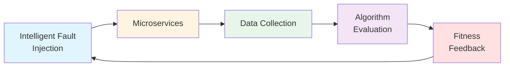

# OperationsPAI Community

> **Building the Future of Root Cause Analysis Together**

Welcome to the OperationsPAI community repository! This is your starting point for understanding our vision, values, and how to participate in building a self-evolving RCA ecosystem.

---

## About OperationsPAI

OperationsPAI is an **open-source community** building the world's first **self-evolving training environment** for Root Cause Analysis (RCA) in microservices.

### Our Mission

Bridge the gap between academic research and industrial practice by creating an intelligent platform where:
- Researchers can develop and evaluate RCA algorithms with continuously generated data
- Practitioners can test and deploy production-ready RCA solutions
- Students can learn distributed systems through hands-on experience

### What Makes Us Different

Unlike static benchmarks, we use **intelligent fault injection** that evolves with your algorithms:

**The stronger your algorithm, the harder the faults become.**

**Core Principles:**

- 🌐 **Open by Default**: All code, data, and research openly shared
- 🔬 **Research Meets Practice**: Academic rigor with production readiness
- 🤝 **Community First**: Success measured by community growth
- 🎯 **Quality Over Speed**: Build it right, not just fast

---

## Why OperationsPAI?

### For Researchers 🎓

- **No more "no data" problem**: Dynamic data generation for any fault scenario
- **Reproducible experiments**: Standardized environment and evaluation metrics
- **Focus on algorithms**: Skip the infrastructure setup, dive into innovation

### For Engineers 🛠️

- **Evaluate before deploy**: Compare RCA algorithms on standardized benchmarks
- **Learn from research**: Access cutting-edge algorithms from academia
- **Contribute scenarios**: Share your real-world challenges (anonymized)

### For Students 📚

- **Hands-on experience**: Work with realistic distributed systems
- **Multiple entry points**: From testing to algorithm development
- **Build your portfolio**: Contribute to a growing open-source project

---

## Getting Started

### For New Community Members

1. **Understand Our Vision**: Read [Vision & Mission](docs/community/vision.md)
2. **Learn Our Values**: Review [Core Values](docs/community/values.md)
3. **Join the Conversation**: [GitHub Discussions](https://github.com/OperationsPAI/operationspai.github.io/discussions)
4. **Find Your First Task**: Browse [Good First Issues](https://github.com/search?q=org%3AOperationsPAI+label%3Agood-first-issue+state%3Aopen&type=issues)

### For Contributors

- **Code Contributions**: See [Contributing Guide](CONTRIBUTING.md)
- **Documentation**: Help improve our docs
- **Testing**: Verify installation on different platforms
- **Community Support**: Answer questions in GitHub Discussions

### For Users

- **Quick Start**: [30-minute demo](https://operationspai.github.io/quickstart) (coming soon)
- **Documentation**: [Technical docs](https://operationspai.github.io)
- **Repositories**: Browse our [GitHub organization](https://github.com/OperationsPAI)

---

## Project Repositories

OperationsPAI consists of multiple interconnected repositories:

| Repository | Description | Status |
|------------|-------------|--------|
| [AegisLab](https://github.com/OperationsPAI/AegisLab) | Core orchestration platform | ✅ Active |
| [Pandora](https://github.com/OperationsPAI/Pandora) | Intelligent fault scheduler | 🚧 In Progress |
| [RCABench Platform](https://github.com/OperationsPAI/rcabench-platform) | Algorithm evaluation framework | ✅ Active |
| [chaos-experiment](https://github.com/OperationsPAI/chaos-experiment) | Fault injection framework | ✅ Active |
| [train-ticket](https://github.com/OperationsPAI/train-ticket) | Demo microservices app | ✅ Active |
| [loadgenerator](https://github.com/OperationsPAI/loadgenerator) | Traffic generation tool | ✅ Active |

📖 **[Technical Architecture](https://operationspai.github.io/architecture)**

---

## Roadmap

**Current Focus (2026 Q1-Q2):**

- 🔥 Community infrastructure (website, documentation)
- 🔥 Quick Start guide (30-minute demo)
- 🔥 Code cleanup and standardization
- 🚧 Intelligent fault scheduling loop
- 📋 Additional microservice targets

See our **[detailed roadmap](ROADMAP.md)** for the full 18-month plan.

---

## Community Governance

### How We Work

- **Decision Making**: See [Governance Model](GOVERNANCE.md)
- **Code of Conduct**: Read our [Code of Conduct](CODE_OF_CONDUCT.md)
- **Contribution Process**: Follow the [Contributing Guide](CONTRIBUTING.md)

### Communication Channels

- 💡 **GitHub Discussions**: [Discussions](https://github.com/OperationsPAI/operationspai.github.io/discussions) - Q&A and discussions
- 🐛 **GitHub Issues**: [Issues](https://github.com/OperationsPAI) - Bug reports and features
- 🐦 **Twitter**: [@OperationsPAI](https://twitter.com/operationspai) - Updates and announcements

### Resources

- 📖 **Documentation**: [docs/community/resources.md](docs/community/resources.md)
- 🎯 **Vision**: [docs/community/vision.md](docs/community/vision.md)
- 💎 **Values**: [docs/community/values.md](docs/community/values.md)

---

## Documentation

### Community Documentation
- [Vision & Mission](docs/community/vision.md) - Our long-term goals
- [Core Values](docs/community/values.md) - Principles that guide us
- [Resources](docs/community/resources.md) - Links and learning materials
- [Roadmap](ROADMAP.md) - Project timeline and milestones
- [Governance](GOVERNANCE.md) - How decisions are made
- [Contributing](CONTRIBUTING.md) - How to get involved
- [Code of Conduct](CODE_OF_CONDUCT.md) - Community standards

### Technical Documentation
- [Technical Architecture](https://operationspai.github.io/architecture)
- [API Reference](https://operationspai.github.io/api)
- [Quick Start Guide](https://operationspai.github.io/quickstart)
- Repository-specific docs in each repo's README

---

## For Researchers

If you use OperationsPAI in your research:

- **Cite Our Work**: Citation format coming soon
- **Share Your Papers**: We'll list papers using OperationsPAI
- **Collaborate**: Join our research discussions in GitHub Discussions
- **Contribute Algorithms**: Add your RCA algorithms to the platform

**Papers using OperationsPAI**: [Coming soon]

---

## License

OperationsPAI is released under the [Apache 2.0 License](LICENSE).

---

## Acknowledgments

OperationsPAI is built on top of several excellent open-source projects:

- [Chaos Mesh](https://chaos-mesh.org/) - Chaos engineering platform
- [OpenTelemetry](https://opentelemetry.io/) - Observability framework
- [TrainTicket](https://github.com/FudanSELab/train-ticket) - Microservice benchmark

---

  <strong>Built with ❤️ by the OperationsPAI Community</strong>

  <a href="https://operationspai.github.io">Website</a> •
  <a href="https://github.com/operationspai">GitHub</a> •
  <a href="https://twitter.com/operationspai">Twitter</a>

