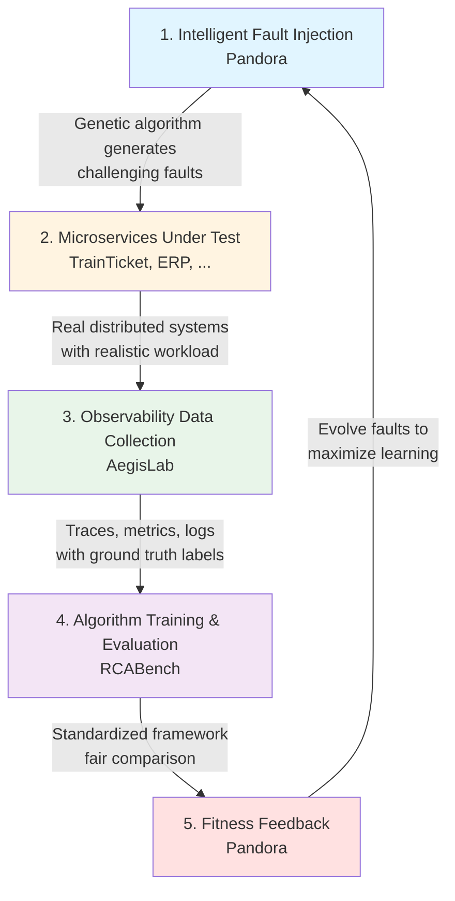

# OperationsPAI Vision

## The Problem

Root Cause Analysis (RCA) in microservices is fundamentally broken:

### For Researchers
- **Static Benchmarks**: Existing datasets become stale, algorithms overfit
- **Limited Scenarios**: Real-world complexity not captured in fixed datasets
- **Reproducibility Crisis**: Hard to compare algorithms fairly across different conditions
- **Data Scarcity**: Collecting labeled fault data is expensive and time-consuming

### For Practitioners
- **Algorithm Fragmentation**: Dozens of RCA papers, few production-ready implementations
- **Evaluation Gap**: Unclear which algorithms work in real systems
- **Integration Complexity**: Each algorithm requires custom integration
- **Lack of Tooling**: No standardized platform for testing and deployment

### The Core Challenge

**How do we continuously generate challenging, realistic fault scenarios to train and evaluate RCA algorithms at scale?**

## Our Solution: Self-Evolving Training Ground

OperationsPAI introduces a paradigm shift: **intelligent fault injection that evolves with your algorithms**.

### The Self-Evolving Loop

### Key Innovations

**1. Intelligent Fault Scheduling**
- Genetic algorithm evolves fault scenarios
- Multi-objective optimization: SLO violations + diagnostic difficulty
- Automatically discovers edge cases and complex failure modes

**2. Continuous Data Generation**
- Never-ending stream of labeled training data
- Adaptive difficulty: starts easy, progressively harder
- Diverse scenarios: network, resource, application-level faults

**3. Standardized Evaluation**
- Fair comparison across algorithms
- Reproducible experiments
- Comprehensive metrics (MRR, Avg@k, Top-k accuracy)

**4. Production-Ready Platform**
- Kubernetes-native deployment
- Scalable architecture
- Plugin-based algorithm integration

## What Makes Us Different

### vs. Static Benchmarks (AIOps datasets)
- **Them**: Fixed datasets, algorithms overfit, limited scenarios
- **Us**: Continuously evolving scenarios, adaptive difficulty, infinite data

### vs. Chaos Engineering Tools (Chaos Mesh, Litmus)
- **Them**: Manual fault injection, no intelligence, no RCA focus
- **Us**: Intelligent scheduling, RCA-optimized, end-to-end loop

### vs. RCA Research Papers
- **Them**: One-off implementations, hard to reproduce, no tooling
- **Us**: Production-ready platform, standardized framework, community-driven

### vs. Commercial AIOps Platforms
- **Them**: Black-box algorithms, vendor lock-in, expensive
- **Us**: Open-source, transparent, extensible, free

## Our Vision for Impact

### Academic Impact (6-12 months)
- **Benchmark Standard**: OperationsPAI datasets cited in RCA papers
- **Algorithm Innovation**: Researchers use platform to develop new algorithms
- **Reproducibility**: Fair comparison enables scientific progress
- **Collaboration**: Bridge academia and industry

### Industry Impact (12-24 months)
- **Production Adoption**: Companies use platform for RCA in real systems
- **Algorithm Marketplace**: Practitioners choose best algorithms for their needs
- **Operational Excellence**: Reduce MTTR, improve reliability
- **Cost Savings**: Faster incident resolution, fewer outages

### Community Impact (Ongoing)
- **Knowledge Sharing**: Best practices, case studies, tutorials
- **Talent Development**: Students learn RCA through hands-on experience
- **Open Innovation**: Collaborative algorithm development
- **Ecosystem Growth**: Plugins, integrations, extensions

## Long-Term Vision (3-5 years)

### Technical Vision
- **Multi-Modal RCA**: Integrate logs, metrics, traces, and code
- **LLM-Powered RCA**: Natural language explanations and remediation
- **Predictive RCA**: Detect issues before they cause outages
- **Automated Remediation**: Close the loop from detection to fix

### Community Vision
- **Global Community**: 1000+ contributors, 100+ organizations
- **Regional Chapters**: Local meetups and user groups
- **Annual Conference**: OperationsPAI Summit
- **Certification Program**: Recognized RCA expertise

### Research Vision
- **New Paradigms**: Beyond trace-based RCA
- **Cross-System RCA**: Root causes spanning multiple systems
- **Causal Inference**: Rigorous causal reasoning in distributed systems
- **Human-AI Collaboration**: Augment human operators, not replace them

## Why Now?

### Technology Convergence
- **Microservices Everywhere**: Complexity demands better RCA
- **Observability Maturity**: OpenTelemetry provides standardized data
- **AI/ML Advances**: New algorithms need better training data
- **Cloud-Native Tools**: Kubernetes enables scalable experimentation

### Market Readiness
- **Pain Point Validated**: Companies struggle with RCA at scale
- **Open Source Momentum**: Community-driven innovation accelerating
- **Research Interest**: Growing academic focus on AIOps
- **Funding Availability**: Grants and investments in reliability

## Join Us

We're building the future of Root Cause Analysis. Whether you're:

- **Researcher**: Develop and evaluate new algorithms
- **Practitioner**: Deploy RCA in production systems
- **Student**: Learn distributed systems and AI/ML
- **Contributor**: Build tools that matter

**There's a place for you in OperationsPAI.**

---

**Let's make RCA intelligent, automated, and accessible to everyone.**

[Get Started](https://operationspai.github.io/quickstart) | [GitHub Discussions](https://github.com/OperationsPAI/operationspai.github.io/discussions) | [Contribute](../../CONTRIBUTING.md)
